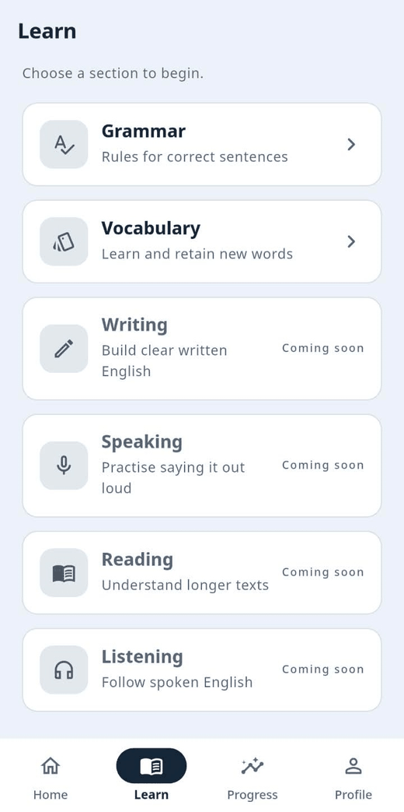
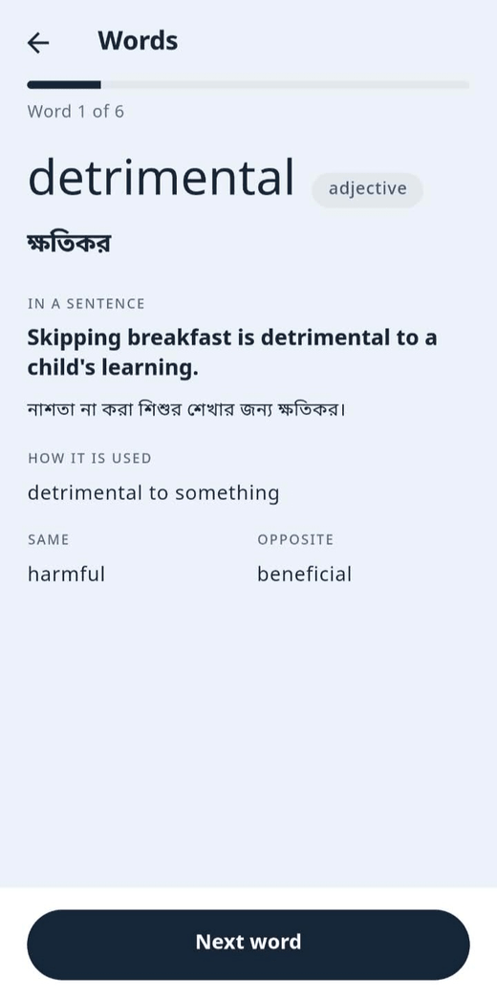
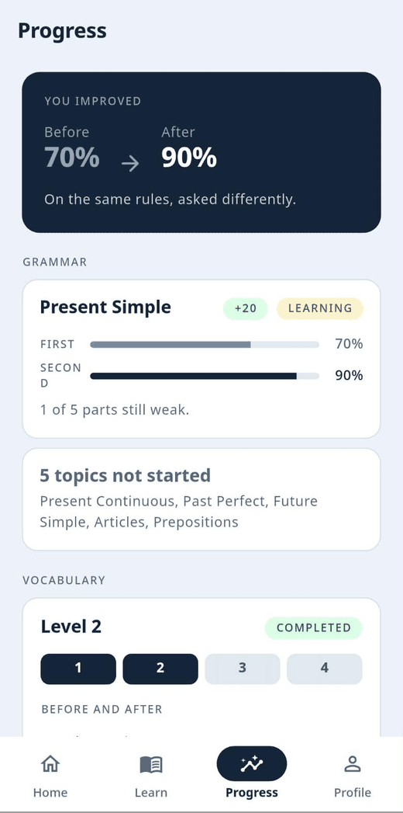
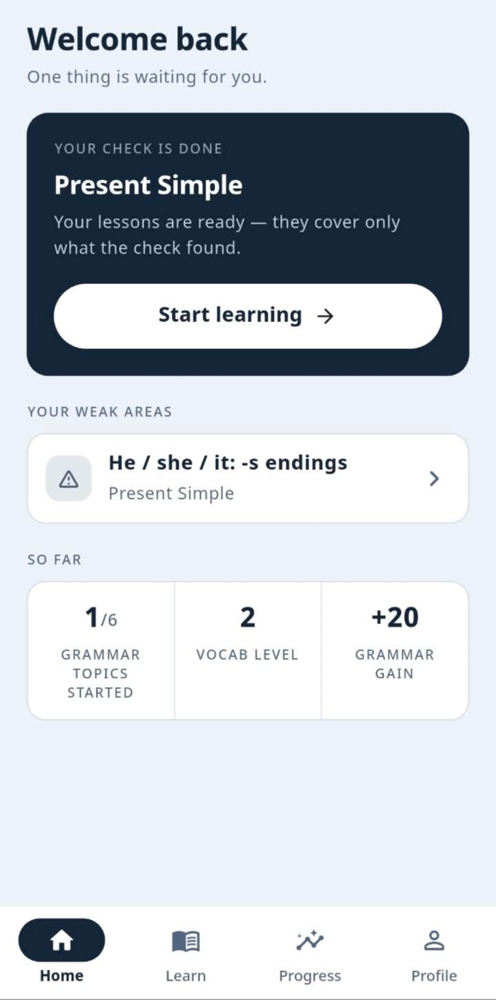
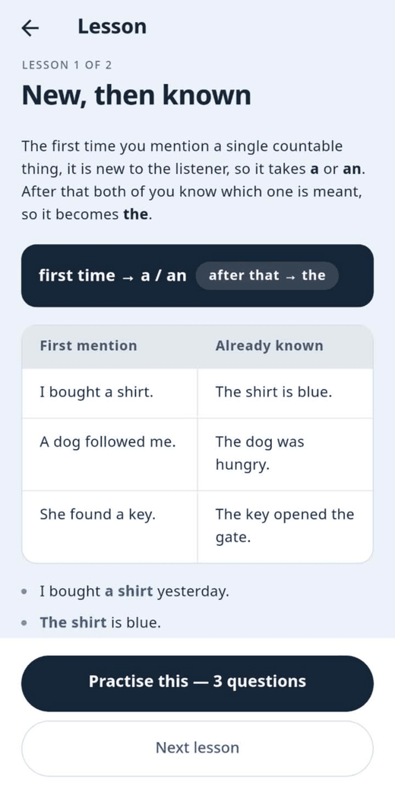
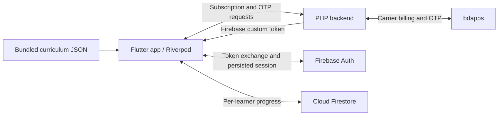

# EngCoach

**Personalized English learning, explained in Bangla.**

EngCoach is an Android app for Bangladeshi learners. It identifies gaps in a
learner's English, builds a focused learning path, and measures improvement
with a separate final check. Access uses daily carrier billing through bdapps
for Robi and Cirkle numbers.

[Website](https://bdappsdigitalapps.com/engcoach/) ·
[Download APK](https://bdappsdigitalapps.com/engcoach/engcoach.apk) ·
[GitHub](https://github.com/Tahmidul-Islam-Omi/EngCoach)

## Product overview

The learning model is:

**Assess → Learn → Practice → Re-assess → Review → Mastery**

Learners study the areas their assessment identifies, rather than following
the same fixed course as everyone else. Lessons use Bangla explanations and
English examples. Completing a lesson or passing a final check does not imply
long-term mastery.

Grammar and Vocabulary currently implement assessment, targeted learning,
practice, and re-assessment. Spaced review and mastery tracking are planned.
Writing, Speaking, Reading, and Listening appear as “Coming soon.”

The configured subscription price is **Tk 2.78/day**, including VAT, SC, and SD,
with automatic renewal. Supported phone prefixes are `018` and `016`. Signing
out does not cancel a subscription; cancellation is available from Profile or
by sending `STOP engcoach` to `21213`.

## Features

| Area | Current functionality |
| --- | --- |
| Grammar | Topic checks, personalized paths, Bangla lessons, practice with feedback, and before/after results |
| Vocabulary | Adaptive placement, focused word sets, contextual examples, practice, final checks, and level progression |
| Home | A recommended next action, mixed weak areas, and learning statistics |
| Learn | Grammar and Vocabulary entry points, with four future sections |
| Progress | Grammar improvement, topic progress, vocabulary levels and area scores, and dated assessment summaries |
| Profile | Phone number, membership date, subscription status, app version, sign-out, and cancellation |
| Accounts | bdapps subscription/OTP integration, Firebase custom-token sessions, and per-learner Firestore progress |

The current app uses authored curriculum and deterministic assessment rules.
It does not make runtime LLM calls. AI-assisted Writing assessment is future
work.

## Screenshots

| Home | Learn | Grammar lesson | Vocabulary | Progress |
| --- | --- | --- | --- | --- |
|  |  |  |  |  |

Additional design references are in [docs/ui](docs/ui/README.md). These are
prototypes; implementation and current content determine actual behavior.

## Learning flows

### Grammar

1. Choose a topic and take a diagnostic check.
2. Receive a path containing the areas below the qualifying score.
3. Read the relevant lessons and answer practice questions with feedback.
4. Take a final check drawn from a different question bank.
5. Compare before/after scores and review remaining weak areas.

The six topics are Present Simple, Present Continuous, Past Perfect, Future
Simple, Articles, and Prepositions. Each topic defines its own assessment
configuration. Current content draws **two questions per area**, with
**two correct answers** needed to qualify. Content notes identify this as a
temporary testing configuration; the original three-question production
setting has not been restored. Questions are sampled from the selected bank
and answer options are shuffled without modifying cached content.

Pre-check questions provide no answer feedback. Final-check and practice
questions include feedback. Pre and post banks must remain distinct so the
comparison measures application rather than memorization.

Grammar status progresses through `notStarted`, `tested`, `learning`, and
`completed`. A `mastered` value exists but is not assigned by current flows.
Assessment saves clear lesson completion markers for the new plan; practice
completion records participation rather than mastery.

### Vocabulary

Vocabulary has four levels and six assessed areas:

- Word meaning
- Word usage
- Synonyms and antonyms
- Words that go together
- Phrasal verbs
- Word formation

The initial check follows the ladder in
[course.json](content/vocabulary/course.json):

- Ask one question per area at a level.
- Advance with at least five correct answers out of six.
- At four out of six, ask two additional probe questions; both must be correct
  to advance.
- Stop at the settled level or the highest level, Level 4.

The resulting plan focuses on weak areas at the settled level. Learners read
word cards with meanings and examples, then complete each set's practice. The
final check asks one question per area plus two extra questions per focus area.
Its questions test taught words in new contexts. Clearing a level opens the
next level; a new check replaces the previous plan and completion markers.

## Technology stack

| Layer | Technology |
| --- | --- |
| App | Flutter, Dart, Material widgets |
| State and presentation | Riverpod 3, MVVM-style feature organization |
| Navigation | go_router with persistent tab navigation |
| Authentication | Firebase Auth using server-generated custom tokens |
| Progress storage | Cloud Firestore |
| Curriculum | Bundled JSON assets, parsed with json_serializable |
| Subscription backend | PHP on cPanel, bdapps SDK, HTTP APIs |
| Landing page | Static HTML and local PNG screenshots |
| Testing | flutter_test, repository fakes, widget tests, content validation |
| Typography | Bundled Noto Sans Bengali |

The working toolchain is Flutter **3.44.0** with Dart **3.12**. Exact package
versions are recorded in [pubspec.lock](pubspec.lock). App version: `1.0.0+1`.
Android application ID: `com.engcoach.app`.

Android is the configured platform. Although a web scaffold exists, Firebase
initialization currently supports Android only. SDK levels inherit Flutter's
defaults in [build.gradle.kts](android/app/build.gradle.kts); the minimum with
the current toolchain is API 24 (Android 7.0). Java compatibility is set to 17.

## Architecture

Widgets form the view layer. Riverpod `Notifier`, `AsyncNotifier`, and
`FutureProvider` implementations coordinate presentation state. Repository
interfaces isolate content and progress access; services isolate subscription
requests and Firebase sessions.



Key components:

- `ContentRepository` and `VocabularyRepository` load and cache asset content.
- `ProgressRepository` and `VocabProgressRepository` store learner progress.
- `AuthService` communicates with the PHP subscription endpoints.
- `SessionService` exchanges custom tokens and restores Firebase sessions.
- `learnerSnapshotProvider` combines grammar and vocabulary data for Home and
  Progress.
- The sealed `NextStep` model selects Home's next action, prioritizing ongoing
  work and using recent activity to resolve competing suggestions.
- Shared widgets and `AppColors`, `AppSpacing`, and `AppTypography` keep
  presentation consistent across features.

### Navigation

| Route | Purpose |
| --- | --- |
| `/` | Home |
| `/learn` | Learning sections |
| `/learn/grammar` | Grammar topics |
| `/learn/vocabulary` | Vocabulary overview |
| `/progress` | Learning progress |
| `/profile` | Account and subscription |
| `/topic/:id/...` | Grammar checks, paths, lessons, and practice |
| `/vocabulary/...` | Vocabulary checks, paths, word cards, and practice |
| `/sign-in`, `/starting` | Sign-in and session restoration |

The four main tabs use `StatefulShellRoute.indexedStack`. Focused flows use
the root navigator so the tab bar does not interrupt an assessment. The router
waits for restored authentication and subscription state before allowing access.
Use `context.go` for tab navigation and `context.push` for focused flows.

## Repository structure

```text
lib/
  app/                     Startup, router, theme, debug flags
  core/                    Shared extensions
  data/
    models/                Grammar and vocabulary domain models
    repositories/          Content, progress, and learner snapshots
    services/              Subscription API and Firebase sessions
  features/
    auth/                  Sign-in and startup
    assessment/            Grammar pre/post checks
    grammar/               Topic list and overview
    lesson/                Learning paths and lessons
    practice/              Grammar practice
    vocabulary/            Placement, word sets, practice, final checks
    home/ learn/ progress/ profile/
  shared/widgets/          Reusable presentation components
content/
  grammar/                 Six topic JSON files
  vocabulary/              Course configuration and four level files
assets/                    Brand assets and Bengali fonts
test/                      Unit, widget, and content tests; support fakes
tools/                     Grammar content validator
android/                   Android project and Firebase client configuration
cpanel_backend/            PHP endpoints, SDK, landing page, screenshots
docs/                      Product specification, flow designs, and FAQ
firestore.rules            Owner-scoped Firestore access rules
```

## Local setup

### Prerequisites

- Flutter 3.44.0 / Dart 3.12, or a compatible toolchain satisfying
  [pubspec.yaml](pubspec.yaml).
- Android SDK and a device or emulator supporting the configured minimum SDK.
- A Java toolchain compatible with the Android build configuration.
- Access to the configured Firebase project and PHP backend for real sign-in.
  Unit and widget tests use fakes and do not require carrier billing.

### Run the app

```bash
git clone https://github.com/Tahmidul-Islam-Omi/EngCoach.git engcoach
cd engcoach
flutter doctor
flutter pub get
flutter devices
flutter run -d DEVICE_ID
```

Replace `DEVICE_ID` with an Android device ID from `flutter devices`.

Generated model files are committed. Regenerate them after changing annotated
JSON models:

```bash
dart run build_runner build --delete-conflicting-outputs
```

### Configuration

The repository includes Android Firebase client configuration for
`engcoach-app`: [google-services.json](android/app/google-services.json) and
[firebase_options.dart](lib/firebase_options.dart). These are public client
configuration, not server credentials.

For a separate installation, register `com.engcoach.app` in your Firebase
project, replace/regenerate its client configuration, deploy
[firestore.rules](firestore.rules), and configure the backend to sign tokens
for that same project. The PHP base URL is `_defaultBaseUrl` in
[auth_service.dart](lib/data/services/auth_service.dart).

Real OTP verification activates a paid subscription. For local feature work,
follow the test suite's provider overrides rather than using live billing
as a fixture.

## Validation

```bash
dart analyze
flutter test
dart run tools/validate_content.dart content/grammar
flutter test test/vocabulary_content_test.dart
```

The grammar validator expects grammar topic JSON. Always pass
`content/grammar`: its default `content` directory also includes vocabulary
JSON with a different schema. The dedicated vocabulary test validates that
curriculum.

Tests cover assessment assembly/scoring, learning paths, progress persistence,
auth behavior, navigation, screen states, and content constraints. Repository
fakes in [test/support/fakes.dart](test/support/fakes.dart) support isolated
tests, including delayed reads for cold-start loading behavior. Schema checks
do not replace human review of question quality.

## Curriculum and authoring

Content ships inside the APK; Firestore stores progress. Changing curriculum
requires rebuilding and redistributing the app.

| Content | Current inventory |
| --- | --- |
| Grammar topics | 6 |
| Grammar areas / lessons | 33 / 33 |
| Grammar assessment questions | 396 across separate pre/post banks |
| Grammar practice questions | 99 |
| Vocabulary levels / word sets | 4 / 24 |
| Vocabulary word cards | 144 |
| Vocabulary assessment questions | 144 |
| Vocabulary practice questions | 120 |

Grammar topic JSON contains metadata, assessment configuration, area-specific
question banks, and lessons. Vocabulary uses a shared course configuration and
level files containing banks, word cards, and practice sets. Read-only models
use `json_serializable` with `createToJson: false` where appropriate.

Authoring rules:

- Keep IDs stable; stored progress references topic, area, and set IDs.
- Give every question exactly one correct option and unique IDs.
- Keep pre-check banks distinct from final-check banks.
- Omit feedback in pre-check questions; provide feedback for every final-check
  and practice option.
- Tag vocabulary final-check questions with `tests`, naming a taught word.
- Keep English examples in English and explanations accessible in Bangla.
- Review distractors for other valid English answers; this has been a recurring
  content defect.
- Update question counts, thresholds, and banks together when changing a check.

Content has been drafted with AI assistance and reviewed by the maintainer.
Work in small reviewable batches rather than generating an entire curriculum
without review.

## Progress storage

The Firebase UID is the normalized, 11-digit phone number. Progress lives
under its user document:

```text
users/{phone}
  phone, createdAt, lastSeenAt
  topics/{topicId}
    status, weakSubSkills[], completedSubSkills[], updatedAt
    preAssessment:  { correct, total, percent, takenAt, subSkills[] }
    postAssessment: { correct, total, percent, takenAt, subSkills[] }
  sections/vocabulary
    level, focusSubSkills[], completedChunks[], updatedAt
    before: [{ id, correct, total }]
    after:  [{ id, correct, total }]   # present after a final check
```

[Firestore rules](firestore.rules) allow authenticated users to access their
own subtree, with `request.auth.uid == phone` and a valid phone-number format.
They do not independently verify subscription entitlement. The app performs
the subscription gate, and backend identity verification is essential to
making the ownership rule meaningful.

Learning writes use ordinary document writes and `arrayUnion` for completion
markers so Firestore can queue writes offline. Vocabulary plan saves replace
the document deliberately; completion updates merge. Grammar status preserves
the furthest reached state, while scores and current plans can change.
`touch()` uses a transaction for account metadata; that is separate from
assessment and practice persistence.

Stored assessments are current pre/post snapshots, not an append-only history
of every attempt. Vocabulary's `updatedAt` also changes during practice.
Screens must not infer streaks, time spent, or a complete assessment history
from these fields.

## Subscription and PHP backend

The backend keeps the bdapps password and Firebase service-account key out of
the APK. The app sends HTTPS requests to PHP endpoints; successful sign-in
returns a custom token that Firebase Auth exchanges for a persisted session.

| File | Role |
| --- | --- |
| `check_subscription.php` | Query status and return a session for an existing subscriber |
| `send_otp.php` | Request a subscription OTP and return its `referenceNo` |
| `verify_otp.php` | Verify the OTP, activate the subscription, and return a session |
| `unsubscribe.php` | Cancel the subscription |
| `firebase_token.php` | Server-side token-signing helper included by endpoints |
| `subscription_listener.php` | bdapps callback; currently logs notifications |
| `sms.php` | Incoming SMS callback; currently an echo stub |
| `ussd.php` | USSD menu handler; USSD was disabled in the recorded portal configuration |
| `sdk_file.php` | Vendor bdapps SDK |

Callback filenames are registered in the bdapps portal; renaming them requires
updating those registrations. Preserve vendor SDK code when editing endpoints.

### Integration behavior

The following cases are documented from earlier integration testing:

| Response / state | Meaning and handling |
| --- | --- |
| `E1351` | An already-subscribed number cannot request another subscription OTP |
| `E1325` | Unsupported carrier |
| `E1343` | Number is not whitelisted in Limited Production |
| `E1850` | Wrong OTP; the existing reference can be retried |
| `INITIAL CHARGING PENDING` | Accepted as subscribed while the charge settles; previously observed for roughly 40–60 seconds |

Subscription SMS keyword: send `engcoach` to `21213`. Cancellation keyword:
send `STOP engcoach` to `21213`.

The recorded portal setup enabled subscription notifications, HTTP requests,
and subscriber OTP confirmation, with USSD and bKash disabled. An Active
Production update was reported in September 2026, but confirmation using a
non-whitelisted number remained pending in previous project notes. Verify
current portal settings before relying on production availability.

### Server configuration

1. Use PHP hosting with cURL and OpenSSL support.
2. Copy [config.example.php](cpanel_backend/config.example.php) to the ignored
   `config.php` and set the bdapps credentials on the server.
3. Store Firebase service-account JSON **outside the web root**. The helper
   reads `/home/bdappsd1/secure/firebase-key.json`; adjust that path when moving
   hosts. An ignored PHP-key fallback has an
   [example template](cpanel_backend/firebase_key.example.php).
4. Upload the PHP files and configure callback URLs in the bdapps portal.
5. Confirm the Firebase project, client configuration, server key, and rules
   agree before testing sign-in and progress sync.

Never commit live `config.php`, service-account keys, `.env` files, or private
keys. Service-account JSON inside `public_html` can be served as a static
download. See [backend documentation](cpanel_backend/README.md) for additional
hosting context.

## Build and deployment

```bash
flutter build apk --release
```

The APK is written to `build/app/outputs/flutter-apk/app-release.apk`.
Deployment is manual through cPanel File Manager:

1. Upload the APK as `engcoach.apk` under `public_html/engcoach/`.
2. Upload [index.html](cpanel_backend/index.html) and `shot-1.png` through
   `shot-5.png` together when the landing page changes.
3. Upload changed PHP files separately, retaining server-only credentials.

The landing page uses inline styling/scripts and local screenshots. There is
no automated deployment pipeline in this repository.

**Release signing is unfinished:** the Android release build currently uses
the debug signing configuration. Configure a proper release keystore before
broader distribution. Android updates require compatible signing keys;
switching keys affects already-installed builds.

Moving hosts also requires updating the app's backend base URL, service-account
path, landing-page links, and registered bdapps callbacks.

## Known limitations and roadmap

### Authentication and release readiness

`check_subscription.php` currently issues a token for an existing subscriber
based on the typed phone number alone. It does not prove ownership of that
number. This allows impersonation of an existing subscriber and must be fixed
before a public release. bdapps subscription OTP cannot verify that case
because it returns `E1351` for existing subscriptions.

The planned fix is an application-managed SMS verification code sent through
the bdapps SMS API, with hashed storage, expiry, attempt limits, and resend
controls. Mint a Firebase token only after successful verification. This flow
is **not implemented**. The cancellation endpoint also needs an authenticated
ownership check rather than trusting a submitted phone number.

Other unfinished release work includes release signing, Terms and Privacy
documents, account deletion including Firestore subcollections, and production
error reporting such as Crashlytics.

### Learning and progress

- Writing, Speaking, Reading, and Listening are placeholders.
- Spaced review and the Error Notebook are not implemented.
- Existing storage does not support reliable streaks, daily goals, or
  time-on-task reporting.
- Vocabulary comparison needs care: initial scores may aggregate multiple
  ladder levels, while the final check measures one level. Progress currently
  presents per-area answer counts.
- Follow-up issues include stale cached vocabulary/membership data after an
  account change, completed vocabulary word cards failing to advance, and
  Home skipping completed grammar topics even if a retake finds weak areas.

### Next section: Writing

Writing is the next planned module. It should reuse the same assessment,
targeted learning, practice, and re-assessment loop, with rubric-based feedback
on Task Response, Organization and Coherence, Grammar, Vocabulary, and
Mechanics.

Design and audit the required data before implementing screens. Keep model
access behind a provider-independent server interface using the existing PHP
backend or Cloud Functions; API keys must never ship in Flutter assets or the
APK. Model selection, caching, usage limits, and assessment costs remain
implementation decisions. Extend the learner snapshot when Writing needs to
contribute to Home and Progress.

## Development conventions

- Use “part” or “area” in learner-facing text, rather than “sub-skill.” Grammar
  uses “completed”; vocabulary uses “cleared.”
- Reuse shared widgets and theme tokens. Keep English examples in English;
  avoid Bangla respellings of English words.
- Handle loading, error, and retry states through `AsyncView`. Do not interpret
  a cold-start provider's missing value as an empty learning record.
- Do not watch a provider that a notifier writes to; rebuilding the notifier
  can reset an in-progress check. Read an initial snapshot where appropriate.
- Wait for in-flight reads before mutating progress so a late read does not
  overwrite fresh state.
- Preserve queueable assessment/practice writes rather than introducing
  network-dependent transactions into those paths.
- For new screens, prepare a design review and a data audit before building.
  Show only statistics that stored data can support.
- Use repository fakes for tests. For a regression, confirm the test fails
  without the fix; preserve existing work with backups during temporary edits.
- Use single-line Conventional Commit messages, without a body or
  `Co-Authored-By` trailer.

## Further documentation

| Document | Purpose |
| --- | --- |
| [Product specification](docs/SPEC.md) / [PDF](docs/EngCoach_Product_Specification.pdf) | Product principles, planned modules, and assessment design |
| [Vocabulary flow](docs/EngCoach_Vocabulary_Flow.md) / [PDF](docs/EngCoach_Vocabulary_Flow.pdf) | Placement, focused learning, and final-check design |
| [UI references](docs/ui/README.md) | Screen prototypes and design references |
| [Vocabulary prototype](docs/vocabulary_ui/index.html) | Interactive HTML design reference |
| [Backend README](cpanel_backend/README.md) | cPanel hosting and bdapps integration context |
| [FAQ source](docs/EngCoach_FAQ.tex) / [PDF](docs/EngCoach_FAQ.pdf) | bdapps application FAQ |

The specification includes future work and can differ from current behavior.
The FAQ's `.tex` source is authoritative; its Markdown file is an older draft.
Some older content notes describe a future Firestore curriculum migration;
the current implementation loads curriculum from bundled assets.
